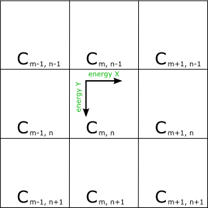

# Bubbles? 
Small Game for the original MS Surface Coffee Table

In 2009 I took a class in *MultiTouch Computing* at the [Umass Lowell Robotics Lab](http://robotics.cs.uml.edu/) that featured the original 
[Microsoft Surface Coffee Table](https://en.wikipedia.org/wiki/Microsoft_PixelSense#Microsoft_Surface_1.0) 
(Which is apparently now called PixelSense 1.0). For my final project in this course I decided to make a game, but focused
on keeping the interactions simple so that anyone could play. The concept was simple, there are Bubbles that appear on
one end of a map, you need to get them to the goal (the circle at the end). The only interaction is creating wind by touching
the screen and dragging your finger. Because of the path it takes to get to the end, and that the bubbles don't last forever,
the game ended up being collaborative because you needed more fingers to reach all the points to curve the bubbles around.

[Watch it in action here (YouTube)](https://www.youtube.com/watch?v=Y6zq7zQv9I4)

This project does require the `XNA SDK` as well as the `Surface SDK` (Although I don't have current information on where to even get the appropriate versions of those now. (The `Surface SDK` might now be the `PixelSense SDK`?)

---
# Documentation from final project write up
What follows is the **Design** section from the final project write up. I've done a little bit of cleanup and formatting, but otherwise haven't really changed it since it was written up in 2009.

## Design
XNA was chosen over WPF for this project. While WPF makes interface design easier and has built in
'chrome' that provides a polished and unified look, it has several layers between the UI and the code
making performance less than ideal. Utilizing XNA, all the graphics are drawn in 2D sprite form, and
rendered using the hardware acceleration provided by the on board graphics card. XNA uses a
SpriteBatch object to draw 2D sprites to the screen using the hardware acceleration of the graphics
card. Normally the SpriteBatch sorts the sprites that get drawn between Begin() and End() calls by
texture. This optimization allows the program to send each texture only once up to the graphics card
per draw loop, speeding up rendering. When sorting this way, the alpha channel of the sprite gets used
to blend overlapping sprites together correctly. The SpriteBatch can also be set to sort by a layer
parameter in each Draw call. While this gives greater control over the drawing of sprites, it slows
things down if you are not careful.

'Bubbles?' was designed with the traditional update/draw loop, with a small exception. The Surface
SDK provides a `ContactTarget` which object which can provide all the current contacts on the surface at
any given time. Rather than parsing all the targets and seeing which were added, moved or removed,
event handlers were registered with `ContactTarget` which run in the background thread.
The game is made up of 6 object types, `FluidSimulation`, `SimCell`, `Particle`, `Emitter`, `Effector`, and
`GameState`.

#### FluidSimulation

The `FluidSimulation` object is the main functional portion of the
game. It consists of a grid of `SimCell`s which make up the
playing field. The `FluidSimulation.Update()` function is called
once through each loop of the main game loop. `Update()`
propagates the energy in `SimCell`s to neighboring `SimCell`s. The
first thing `Update()` does is decay the energy in each `SimCell` by
preset percentage. As it loops through the `SimCell`s, it copies
them into a new array after it decays the energy levels. Every
`SimCell` that has energy, has that energy added to surrounding
`SimCell`s as follows:

An array of `SimCell`s, propagating energy from Cm,n

Propagating energy from Cm,n is dependent on the strength and direction of energy X and energy Y. If
there is only energy in the X or in the Y direction, then that energy is decayed and added to the cell next
to Cm,n based on the direction, unless it is a wall. For example:

> Energy X is positive and energy Y is zero, then decayed energy X is added to Cm+1,n.

If the horizontal or vertical energy hits a wall, then the energy is split and propagated along the wall.

If there energy in both axises, then the both X and Y energies are decayed an added to the cell on the
proper diagonal. The X energy is decayed and added to the cell next to Cm,n on along the X axis, and the
Y energy is decayed and added along to the cell along the Y axis.

When looking at the energyX and energyY values of Cm,n:

> Decayed energy X and decayed energy Y are added to Cm+1,n+1
> 
> Decayed energy X is added to Cm+1,n
> 
> Decayed energy Y is added to Cm,n+1

This model provides a good approximation of wind traveling along the game space when the size of the
cells, and the amount of the decay are adjusted correctly. After the temporary array of `SimCell`s have
been updated to the new values, they are copied back to the main array of `SimCell`s. The copying of the
`SimCell`s to a temporary array and operating on that array avoids a feedback loop. If the energy was
propagated within a single array, energy from the first cell would get propagated to the second. Then
the second cell's energy plus the propagated energy would be propagated to the third and so on. By
propagating to a second array, we avoid this since the starting point is always the original amount of
energy inside a `SimCell`.

The `FluidSimulation` class also provides methods for updating current `Particle` objects, and for applying
a dictionary of `Effector` objects to the simulation. There is also method to set individual `SimCell` objects
as walls.

The `FluidSimulation` object has its' own `Draw` method which gets called from the main loop's `Draw`
method. First a box texture is draw for each `SimCell` object, red for walls, gray otherwise. On top of
these, an arrow texture is drawn in the center of each box, pointing along the vector created by energy
X and energy Y. The brightness of the arrow is proportional to the amount of energy contained in the
cell.

#### SimCell

The `SimCell` object is used to represent a single cell in the simulation. It is a container class holding the
energy values contained in the cell, as well as if the cell is considered a wall or not. It also imposes a
limit on how large the energy can be in both the x and y directions.

#### Particle

Each bubble in 'Bubbles?' is represented by a `Particle` object. The Particle contains position
information, as well as velocity information. A divider is used to convert from a large velocity to a
smaller number of pixels in screen coordinates in the `nextPos()` method. `Particles` can also have a deceleration rate and a life span. The life span gets incremented in the `Update()` method, as the position
gets updated and the velocities get the deceleration applied to them.

#### Emitter

The `Emitter` adds `particles` to the simulation. An `emitter` adds a fixed number of `particles` to the
simulation per call of the `Emit` method. When `particles` are added to the simulation, they are added
inside of a radius centered around the `Emitter`'s screen position. `Particles` are also give an initial
velocity by the `Emitter`.

#### Effector

An `Effector` object injects energy into the simulation grid. An `Effector` can have a set position and
energies to add in the x and y directions, but when used interactively through a touch contact, the
`move()` method is called with a new x and y position. This doesn't actually move the position of the
`Effector`, but rather the distance from the position to the new x and y are used to calculate the energy x
and energy y amounts. A scaling value and the maximum energy settings of the `Effector` come into
play when doing this calculation. The scaling factor is used to convert from a pixel distance to an
acceptable energy amount.

#### GameState

The last object used in the program is the `GameState` object. It is used to set the time limit for the level,
the goal position, and the number of points required to win. It also keeps track of if the game has
started, how much real-time is left, and if the win or time expired states get entered. `GameState` also
has a `checkParticle()` method that stands in for a goal object, and determines if a particle is in the goal
area. If a `particle` is in the goal area the points get incremented, and the won state can be set if the
number of points is high enough, and true is returned. This gets used in the main loop to remove the
particle from the simulation at that time.

#### Game Execution

When the game is running the main program's draw and update methods get called in an endless loop.
The update method first checks to see if someone has touched the giant start bubble on the splash
screen. If they have, then the game begins. In the game itself, update first applies the `Effectors` to the
simulation. Then the energy in the simulation is propagated via the `FluidSimulation.Update()` method.
The `Emitter` then emits new particles, and then the particles are updated or removed. The last thing the
update method does is check to see if level end flags have been thrown before starting over again.

The draw method then kicks in and starts drawing to the screen. First the simulation grid, then arrows
are drawn from each `Effector` to it's corresponding contact point, providing a visual feedback to the
players. Then the particles, the goal bubble and score, then the time remaining are drawn. If the game
isn't running the level it draws the splash screen over and over again with the results of the last attempt.

There were a few issues that came up while running the game in this manner. When the program
initializes, the `ContactTarget` is told to run in the background. The `ContactAdded` event handler adds a
new `Effector` to a dictionary at the contact point. When a `ContactChanged` event is thrown, the contact's ID is used to retrieve the appropriate `Effector` from the dictionary, and its' move method is called. A
`ContactRemoved` event removes the appropriate contact from the dictionary. Because these event
handlers run on the background thread, the system could be applying or drawing the effectors at the
same time we are modifying the dictionary of contacts. To get around this a spin lock is used with a
`boolean` flag in the main loop. Because drawing or updating the `Effectors` is quite fast, this works well
enough to keep the game running smooth without missing a contact event, as the flag isn't set for very
long.

In moving from the Surface Simulator to the actual Surface table a few issues were discovered.
`ContactTarget` doesn't fire a `ContactRemoved` event when the contact is slid off the side of the surface,
and thus `Effectors` get stuck. A small change to check for out of screen bounds in the `ContactChanged`
handler avoids calling move with coordinates that are out of bounds, but it should also remove the
contact as if the finger was lifted off the table.

